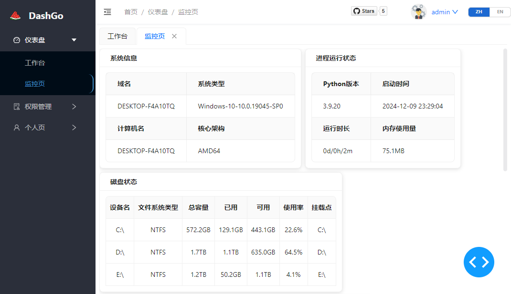
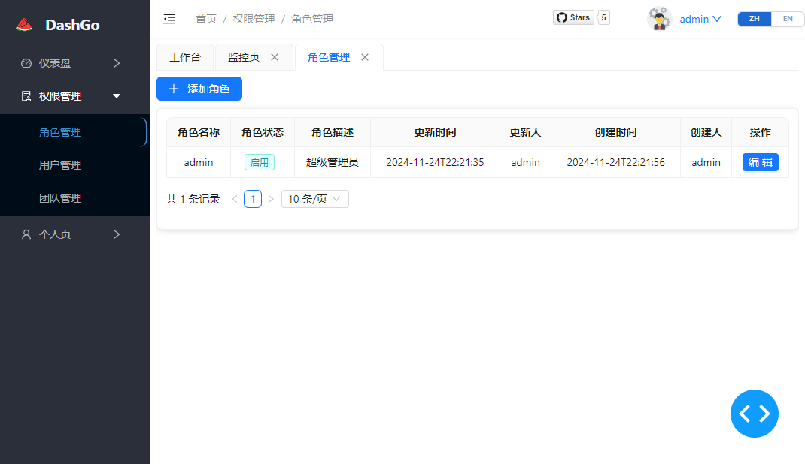
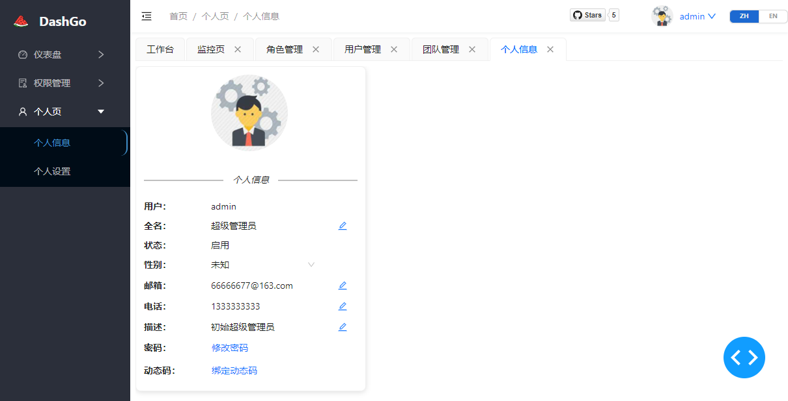
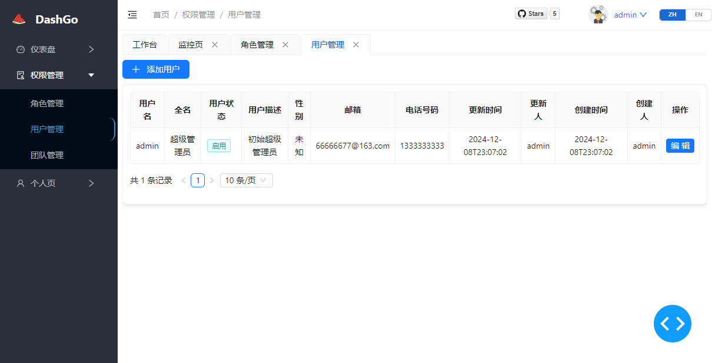
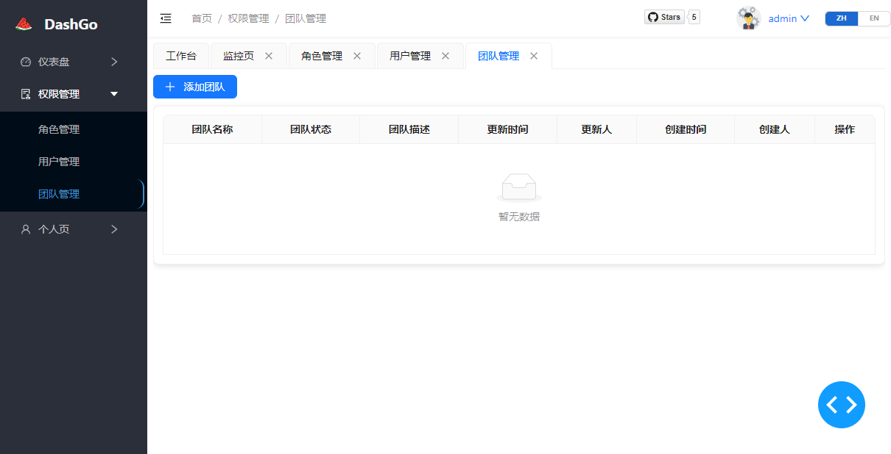

<p align="center">
	
</p>
<h1 align="center" style="margin: 30px 0 30px; font-weight: bold;">DashGo</h1>
<p align="center">
    <a href="https://gitee.com/luojiaaoo/DashGo"></a>
    <a href="https://github.com/luojiaaoo/Plotly-DashGo"></a>
    <a href="https://gitee.com/luojiaaoo/DashGo"></a>
    
    
    
    
</p>

<p align="center">
简体中文 | <a href="docs/README_en.md">English</a>
</p>

## 一、简介
DashGo谐音<u>**大西瓜**</u>，这是一个开箱即用的低代码WEB框架，基于Plotly Dash框架和[Fac](https://fac.feffery.tech/getting-started)开源组件库开发，只需要Python语言实现全栈的后台管理系统开发


### 功能:
1. 多页面管理
2. 组件和函数级别的细粒度权限管理
3. 自带用户、角色和团队的权限的管理
4. i18n国际化组件
5. 密码和OTP登录
6. 支持OAuth2 provider
7. 支持任务模块，支持周期任务/定时任务和监听任务，监听任务暂时只支持邮件POP3协议触发， <a href="docs/task.md">请查看使用文档</a>
8. 任务模块支持数据抽取与个性化信息推送，支持`Server酱`、`企业微信群机器人`、`SMTP邮件`、`Gewechat`，可以实现数据大屏、实时监控和通知推送

### 特点:

1. 极易使用
2. 只需要一个Python文件，就可以将应用嵌入系统，无需额外操作
3. 符合主流数据平台风格
4. 支持周期和定时任务
5. 支持轮询监听外部消息，实现任务触发
6. 丰富的消息通知渠道：`Server酱`、`企业微信群机器人`、`SMTP邮件`、`Gewechat`
7. 通过OAuth2接口+Iframe实现子系统接入（beta，自主开发的子系统见`https://github.com/luojiaaoo/dashgo-knowledge`）

------

## 二、项目结构

```
├─assets                # 静态资源目录
│  ├─imgs                  # 图片资源
│  └─js                    # js文件资源（dash框架预加载js文件、浏览器回调js等）
├─common                # Python共享功能库
│  └─utilities          # Python工具类
├─config                # 项目配置目录
├─dash_callback         # Dash回调库
│  ├─application
│  │  ├─access_
│  │  ├─dashboard_
│  │  └─person_
│  └─pages
├─dash_components       # Dash自定义组件
├─dash_view             # Dash视图
│  ├─application           # 应用视图，以“_”结尾的为内置应用
│  │  ├─access_
│  │  ├─dashboard_
│  │  ├─example_app        # 应用例子
│  │  ├─notification_
│  │  ├─task_
│  │  └─person_
│  ├─framework
│  └─pages
├─database              # 数据库
│  └─sql_db               # 关系型数据库配置
│      ├─dao                # 数据库orm抽象
│      └─entity             # 数据库表实体
└─translations          # 国际化
    └─topic_locales
```

------

## 三、用法

- ### 添加新应用

> 以example_app为例，存在2个应用页面 —— subapp1   subapp2
>
> 在config/access_factory.py中注册以上2个页面，系统会自动识别页面中的配置信息

以应用subapp1为例：

```python
from common.utilities.util_menu_access import MenuAccess
import feffery_antd_components as fac
import feffery_utils_components as fuc
from common.utilities.util_logger import Log
from dash_components import Card


# 二级菜单的标题、图标和显示顺序
title = '应用1'
icon = None
order = 2
logger = Log.get_logger(__name__)

############# 注册权限，固定全局变量名access_metas ################
access_metas = (
    '应用1-基础权限',
    '应用1-权限1',
    '应用1-权限2',
)

############# 返回视图页面的方法，方法名固定为render_content，menu_access为用户权限对象，kwargs为url内的query参数信息 #########
def render_content(menu_access: MenuAccess, **kwargs):
    return fac.AntdFlex(
        [
            *(
                [
                    Card(
                        fac.AntdStatistic(
                            title='展示',
                            value=fuc.FefferyCountUp(end=100, duration=3),
                        ),
                        title='应用1-权限1',
                    )
                ]
                if menu_access.has_access('应用1-权限1')  ############# 判断是否拥有“应用1-权限1”的权限
                else []
            ),
            *(
                [
                    Card(
                        fac.AntdStatistic(
                            title='展示',
                            value=fuc.FefferyCountUp(end=200, duration=3),
                        ),
                        title='应用1-权限2',
                    )
                ]
                if menu_access.has_access('应用1-权限2') ############# 判断是否拥有“应用1-权限2”的权限
                else []
            ),
        ],
        wrap='wrap',
    )
```

- ### 相关功能对象

  1. 在render_content中有参数menu_access可以进行权限的校验，回调中如何实现？

     答：通过get_menu_access，根据cookie中的jwt的用户名字段，查询数据库，获取权限对象

     ```python
     from common.utilities.util_menu_access import get_menu_access
     menu_access = get_menu_access()
     menu_access.has_access('xxx')
     ```

     如果只需要获取cookie中的jwt的用户名字段，减少数据库IO

     ```python
     from common.utilities.util_menu_access import get_menu_access
     op_name = get_menu_access(only_get_user_name=True)
     ```

- ### 国际化

  1. 在translations\topic_locales中新建json文件（内容格式参考已存在的文件，推荐一级目录的名字来新建文件，下级的应用共用一个国际化json文件，json中的topic字段为主题字段，也推荐和一级目录的名字保持一致）

  2. 在i18n.py中添加，xxxx替换为一级目录的名字

     ```python
     t__xxxx = partial(translator.t, locale_topic='xxxx')
     ```

  3. 在需要翻译的视图或者回调函数中，按以下格式替换字符串，即可完成国际化
  
     ```python
     from i18n import t__xxxx
     t__xxxx('Chrome内核版本号太低，请升级浏览器')
     ```

------

## 四、启动平台

1. windows用户根据requirements_win.txt，linux用户根据requirements_linux.txt 安装Python依赖

   > 安装依赖命令： python -m pip install -r requirements_xxx.txt
   >
   > **推荐安装虚拟环境**：[https://blog.csdn.net/m0_37789876/article/details/146011318](https://blog.csdn.net/m0_37789876/article/details/146011318)

2. 切换工作区到src目录

   > windows:     cd /d e:\xxxx
   >
   > linux:            cd /app/xxxx

1. 初始化数据库表结构和admin管理员数据

   > 数据库初始化操作：
   >
   > - 数据库表初始化表结构： python -c "from database.sql_db.conn import create_rds_table; create_rds_table()"
   >
   > - 数据库初始化admin用户：python -c "from database.sql_db.conn import init_rds_data; init_rds_data()"

4. 执行python app.py，即可启动Dash debugger调试模式，根据日志提示中的URL进行访问

   > 生产环境（非debugger）启动命令：
   >
   > - **Windows**：   waitress-serve --host=0.0.0.0 --port=8090 --url-scheme=http --trusted-proxy=* --trusted-proxy-headers=x-forwarded-for --threads=8 app:server
   > - **Linux**:            gunicorn --capture-output -w 4 -b 0.0.0.0:8090 app:server
   >
   > `默认账号`：admin、密码：admin123

3. 如要使用任务中心模块，执行python app_apscheduler.py启动任务进程

4. 请在Dash的世界畅游吧！！！

   > 默认启动为sqlite数据库，如需用于生产，请根据config/dashgo.ini调整相关Mysql数据库配置

------

## 五、截图

|||
| ---- | ---- |
|||
|||
|||
|||


